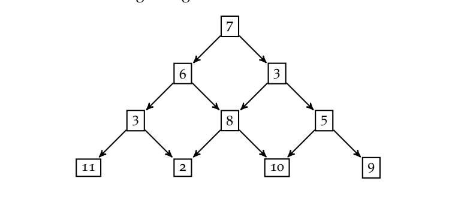

# triangle-path

App reads from stdin lines of numbers organized as a triangle, e.g
```text
7
6 3
3 8 5
11 2 10 9
```

which is internally represented as a tree:


and outputs the path from top:

```text
Minimal path is: 7 + 6 + 3 + 2 = 18
```

# Build
```shell
sbt build
```

The jar file will be produced in 'target' directory

## Run

To run the app, execute:
```text
java -jar target/scala-2.13/triangles-min-path-assembly.jar
```

After program was launched start entering triangle lines of numbers row by row. After you finished, press
Enter twice